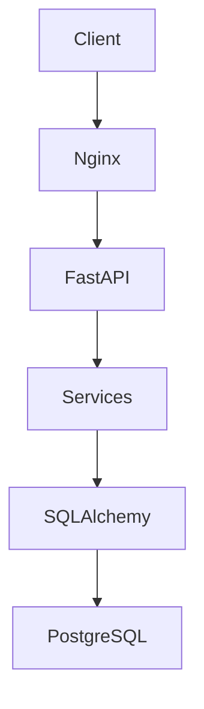

# DevBoard API


DevBoard API is a powerful and robust backend engine tailored for project and task management, designed specifically for small software development teams and independent professionals. 

Built with scalability, performance, and strict tenant isolation in mind, this API handles the complex relationships between users, their projects, and their tasks seamlessly, ensuring absolute data privacy.

## Features
- **Public User Registration**: Open registration for new accounts.
- **User Approval Workflow**: New accounts start as `PENDING` and require manual approval to become `ACTIVE`.
- **JWT Authentication**: Secure login and token generation for approved users.
- **User Management**: Encrypted user registration and private profile retrieval.
- **Project Management**: Full CRUD operations for projects, strictly scoped to their owners.
- **Project Deletion**: Secure deletion of projects with strict ownership validation.
- **Task Management**: Full CRUD operations for tasks hierarchically attached to projects.
- **Task Deletion**: Secure deletion of tasks tied to user's projects.
- **Cascade Delete on Projects**: Deleting a project automatically and safely removes all associated tasks.
- **Tenant Isolation**: Users can never access, edit, or delete projects and tasks belonging to third parties.
- **Dockerized Deployment**: Fully containerized environment ensuring 100% reproducibility.
- **PostgreSQL Persistence**: Robust transactional data integrity using PostgreSQL.
- **Nginx Reverse Proxy**: Secure routing and load balancing handling external HTTP/HTTPS traffic.
- **HTTPS with Let's Encrypt**: End-to-end encryption secured by Certbot SSL certificates.
- **AWS EC2 Deployment**: Cloud-hosted infrastructure for high availability.

## Tech Stack
- **Python** (3.13)
- **FastAPI**
- **SQLAlchemy** (2.0)
- **PostgreSQL**
- **Docker**
- **Docker Compose**
- **Nginx**
- **JWT Authentication**
- **AWS EC2**
- **Certbot / Let's Encrypt**

## Architecture

The system follows a clean, layered architectural approach to separate concerns and ensure maintainability:



- **Nginx**: Acts as the reverse proxy, terminating HTTPS via Let's Encrypt and forwarding requests to the FastAPI backend.
- **FastAPI**: The presentation layer handling HTTP routing, request/response validation (via Pydantic), and dependency injection.
- **Services**: The core business logic layer. All tenant isolation rules and permissions are encapsulated here, preventing the API from directly querying the database and keeping business rules decoupled from web routes.
- **SQLAlchemy**: The modern Object Relational Mapper (ORM) bridging Python objects to the PostgreSQL tables.
- **PostgreSQL**: The production-grade relational database ensuring ACID transactions.
- **Alembic**: The database versioning tool tracking and applying schema migrations dynamically.

## API Documentation

The complete, interactive Swagger documentation is available online at:
[https://api.labprojects.dev.br/docs](https://api.labprojects.dev.br/docs)

## Running Locally

The local development environment is fully encapsulated. You only need Docker and Docker Compose installed.

1. Clone the repository:
   ```bash
   git clone https://github.com/seu-usuario/devboard.git
   cd devboard
   ```
2. Setup environment variables:
   ```bash
   cp .env.example .env
   ```
3. Start the infrastructure in the background:
   ```bash
   docker compose up -d
   ```
The API will be accessible locally at `http://localhost:8000`. You can access the local interactive documentation at `http://localhost:8000/docs`.

> **Note**: For the live production URLs (Frontend, API, and Swagger), please refer to the **Production Environment** section below.

## Environment Variables

The project uses `.env` files to manage configuration. Key variables include:

- `DATABASE_URL`: The full PostgreSQL connection string (e.g., `postgresql://user:password@db:5432/devboard`).
- `SECRET_KEY`: A strong, randomly generated cryptographic key used to sign the JWT tokens.
- `ALGORITHM`: The cryptographic algorithm for JWT (e.g., `HS256`).
- `ACCESS_TOKEN_EXPIRE_MINUTES`: The expiration time for authentication tokens.

## Docker Deployment

To deploy the application to a production server (like AWS EC2):

1. Clone the repository on the target server.
2. Fill the production `.env` file with secure credentials.
3. Build and launch the production containers using Docker Compose:
   ```bash
   docker compose -f docker-compose.prod.yml up -d --build
   ```
4. Setup Nginx locally on the server or via a separate container to reverse-proxy traffic to port `8000`.
5. Issue an SSL certificate using Certbot for your domain.

## Authentication Flow

The API secures routes using **JSON Web Tokens (JWT)** combined with an approval workflow:
1. **Register**: The client sends a `POST` request to `/api/v1/users/` to create an account.
2. **PENDING**: The new user is created with a `PENDING` status, meaning login is blocked.
3. **Approval**: An administrator manually approves the user, changing their status to `ACTIVE`.
4. **ACTIVE**: The user can now send a `POST` request to `/api/v1/auth/login` with their credentials.
5. **JWT**: The server validates the credentials and `ACTIVE` status, returning a signed `access_token`.
6. For all subsequent requests to protected endpoints, the client must include the token in the HTTP Header: `Authorization: Bearer <token>`.

## Main Endpoints

| Method | Endpoint | Description | Auth Required |
| --- | --- | --- | --- |
| `POST` | `/api/v1/auth/login` | Authenticate user and receive JWT | No |
| `POST` | `/api/v1/users/` | Register a new user account | No |
| `GET` | `/api/v1/users/me` | Retrieve the authenticated user's profile | Yes |
| `GET` | `/api/v1/projects/` | List all projects owned by the user | Yes |
| `POST` | `/api/v1/projects/` | Create a new project | Yes |
| `GET` | `/api/v1/tasks/` | List tasks within user's projects | Yes |
| `POST` | `/api/v1/tasks/` | Create a new task within a project | Yes |
| `DELETE` | `/api/v1/projects/{id}` | Delete a project and cascade delete its tasks | Yes |
| `DELETE` | `/api/v1/tasks/{id}` | Delete a specific task | Yes |

## Security

- **JWT (JSON Web Tokens)**: Stateless and secure authentication mechanism.
- **Tenant Isolation**: Deep database queries ensure users can never interact with data they don't own.
- **Owner-based Access Control**: Every CRUD operation validates the `owner_id` against the decoded JWT subject.
- **Protected Deletes**: Deletion endpoints rigorously check ownership before executing DB drops, preventing IDOR vulnerabilities.
- **User Approval Workflow**: Registration is public, but access is private. Prevents spam or unauthorized access by keeping new users in a `PENDING` state until manually vetted.

## Production Environment

This application is actively deployed and hosted on **AWS EC2**, serving requests securely via an **Nginx** reverse proxy equipped with HTTPS encryption provided by **Let's Encrypt**. 

- **Frontend Application**: [https://app.labprojects.dev.br](https://app.labprojects.dev.br)
- **API Base URL**: [https://api.labprojects.dev.br](https://api.labprojects.dev.br)
- **Interactive Swagger Docs**: [https://api.labprojects.dev.br/docs](https://api.labprojects.dev.br/docs)

## Future Improvements

- **Admin Panel for User Approval**: A dedicated web interface to approve or reject `PENDING` users.
- **Role-Based Access Control (RBAC)**: Expand permissions allowing multiple users to collaborate on the same project with distinct roles (Admin, Editor, Viewer).
- **WebSockets / Real-time Updates**: Implement live task updates for concurrent collaborators.
- **Task Comments and Attachments**: Enable users to discuss and upload files directly inside tasks.
- **Automated Email Notifications**: Integrate an SMTP service for password resets and task assignments.

## Author

**Eduardo Santana**
